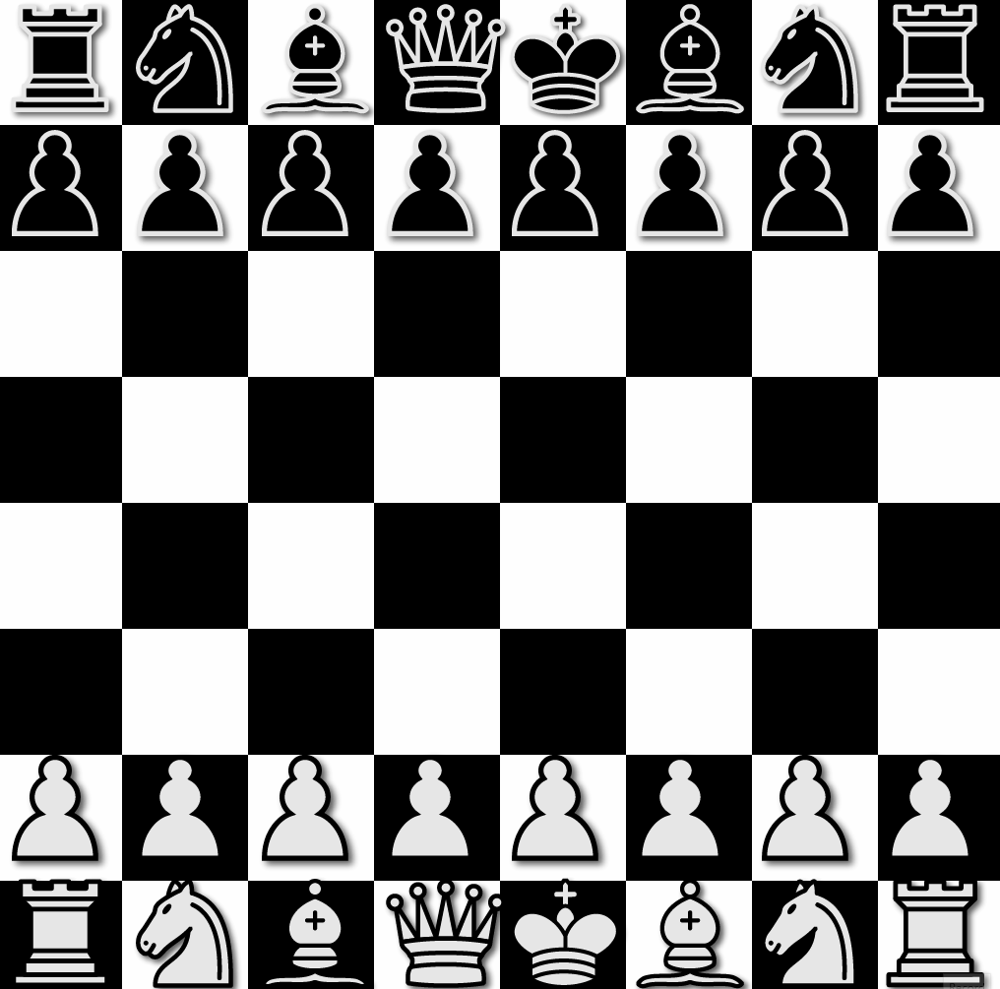

# Chess

This is a C++ implementation of the class game Chess using SFML to display graphics.

I have already coded Chess in this language once before as part of a group project, but this is my own recreation of Chess
from scratch with the aim of improving code quality and adding functionalities.

